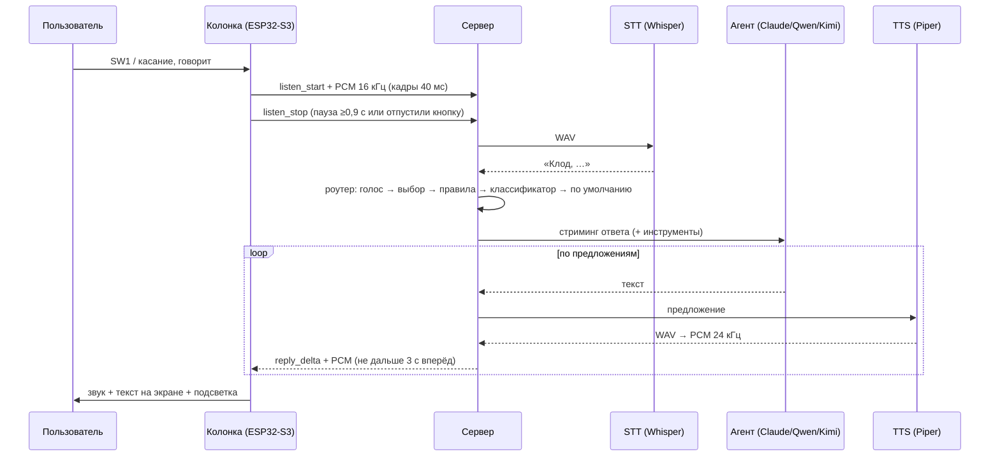

# Архитектура

Колонка — тонкий клиент: звук, экран, свет и кнопки. Вся «умность» живёт на сервере. Поэтому модели меняются без перепрошивки, а локальные Qwen или Kimi на мощном компьютере работают наравне с облачным Claude.

## Поток данных одного вопроса

## Откуда берутся задержки

**«Время до первого звука»** складывается из трёх частей:

1. **Распознавание всей фразы.** На GPU это 0,2–0,6 с, на CPU — 1–3 с, в зависимости от модели Whisper.
2. **Первый токен агента.** У облака 0,5–1,5 с, у локальной модели — от 0,1 с.
3. **Синтез первого предложения.** У Piper на CPU это 0,1–0,3 с.

**Как сервер сокращает ожидание:**

- Первое предложение отправляется в TTS сразу, даже если оно короткое («Конечно.»). Следующие склеиваются в куски по 40 символов и больше.
- Следующие предложения синтезируются заранее, пока звучат текущие: опережение — два предложения.
- Колонка начинает играть, когда накопилось 180 мс звука.
- `normalizePeak` подтягивает громкость фразы перед Whisper, потому что INMP441 тихий.

Задержки каждой реплики (STT, первый токен, первый звук, всего) пишутся в лог и в историю веб-панели.

## Сервер (`server/src`)

| Модуль | Роль |
|---|---|
| `app.js` | собирает всё вместе: HTTP, WebSocket, mDNS, проверки здоровья агентов |
| `hub.js` | протокол колонки: сессии, приём звука, команды |
| `session.js` | состояние колонки: громкость, выбранный агент, история разговора |
| `assistant.js` | конвейер хода: STT → команды → роутер → агент с запасными → озвучка → история |
| `agents/base.js` | общий класс агента, таймауты «первого токена», классификация ошибок |
| `agents/anthropic.js` | Claude: стриминг, `tool_use` → `tool_result` |
| `agents/openai.js` | OpenAI-совместимые серверы: стриминг, `tool_calls`, вырезание `<think>`, повтор без tools |
| `agents/router.js` | выбор агента и порядок запасных |
| `agents/tools.js` | инструменты (время, погода, таймер, громкость, свет, `ask_agent`, `switch_agent`) |
| `speech/stt.js`, `speech/tts.js` | клиенты распознавания и синтеза |
| `speech/streamer.js` | очередь «предложение → TTS → PCM → колонка» с темпом |
| `text/sentences.js` | нарезка потокового текста на предложения |
| `text/clean.js` | чистка markdown и эмодзи, фильтр `<think>` |
| `db.js` | SQLite: колонки и история (если модуль не собрался — память) |
| `timers.js` | таймеры колонок |

**Контекст разговора** общий для всех агентов колонки. Если ты спросил Qwen, а потом обратился к Claude, Claude видит предыдущий обмен. Хранятся последние `history_turns` обменов; после `idle_reset_minutes` тишины разговор начинается заново.

**Ошибки и запасные агенты.** Каждый агент раз в минуту проверяется через `/models`, а у Claude — через наличие ключа и Models API. Если при ответе случилась ошибка соединения, таймаут или ошибка авторизации, агент помечается недоступным до следующей проверки, а ход продолжает следующий агент из `fallback`. Если текст уже начал звучать, ответ завершается фразой «Извини, ответ оборвался», чтобы не начинать сначала.

## Прошивка (`firmware/src`)

| Модуль | Роль |
|---|---|
| `main.cpp` | состояния колонки: Connecting → Idle → Listening → Thinking → Speaking; кнопки, тач, события сервера |
| `audio.cpp` | I2S0 — микрофоны (32 бит стерео → 16 бит моно, ФВЧ, уровень), I2S1 — ЦАП; задачи FreeRTOS на двух ядрах |
| `api.cpp` | Wi-Fi, mDNS-поиск сервера, WebSocket |
| `display.cpp` | LovyanGFX: интерфейс 320×240 через спрайт в PSRAM, кириллица (шрифты efont), тач |
| `leds.cpp` | эффекты матрицы WS2812B |
| `battery.cpp` | напряжение 3S, проценты, критический разряд |
| `dsp.h`, `ring_buffer.h` | чистая логика без Arduino (тестируется на ПК) |

**Звук.** Микрофоны читаются постоянно, на ядре 0, блоками по 16 мс. Поток на сервер включается только в режиме «слушаю». Пока колонка молчит, из этих блоков оценивается фоновый шум для детектора речи.

**Воспроизведение** идёт из кольцевого буфера в PSRAM (1 МБ) задачей на ядре 1. Громкость — программная, с потолком `VOLUME_MAX_GAIN_DB`, чтобы TPA3116 на 12 В не сжёг 10-ваттный динамик.

**Конец фразы.** В режиме «нажал и отпустил» его определяет энергетический детектор речи `dsp::Vad`: адаптивный порог по фону, конец после 900 мс тишины, отмена, если речи не было 5 секунд. В режиме удержания фраза заканчивается, когда отпускаешь кнопку.
